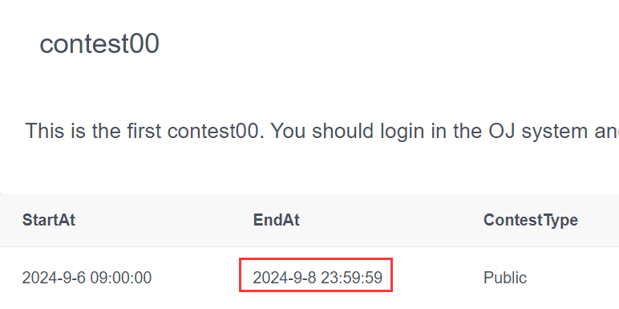

# Lab 00 - Hello World
## Our Goal in Lab 00
1. Set up the C++ development environment in your personal laptop.
1. Register and use the online judge (OJ) system.

## C++ Development Environment
Depending on your operation system, you can choose different C++ development environments. Here are
the tutorials for different operation systems: Windows, Linux, and MacOS.
### Windows
[Windows C++ Environment Setup Tutorial](./c++_env/windows.md)
### Linux
[Linux C++ Environment Setup Tutorial](./c++_env/linux.md)
### MacOS
[MacOS C++ Environment Setup Tutorial](./c++_env/mac.md)

## Online Judge (OJ) System
### Introduction
The [OJ system](https://onlinejudge.hkust-gz.edu.cn/) is a platform where you can submit your code and receive results. It includes a 
compilation environment and can execute programs. While it doesn't offer an interactive terminal to 
display output, it does indicate whether your result is correct.  
When you program runs correctly, you can see:

You can also see the detailed results in the **Status** page.

### Login
An account has been created for each student in the OJ system. Your username is your full name with the last name in uppercase. Your email address is your student email, and your password is your email address without the domain name. For example:
- Username: **Sansan ZHANG**
- Email: szhang678@connect.hkust-gz.edu.cn
- Password: **szhang679**
### Tasks
Today you need to register and login in the OJ system, and finish the problems in [**contest00**](https://onlinejudge.hkust-gz.edu.cn/contest/3/problems). It only contains a simple problem, you can solve it as long as you know how to output information in C++.
### Note
1. The deadline for each contest is 23:59 on Sunday and you must submit your code before then.

1. You can submit your code multiple times.