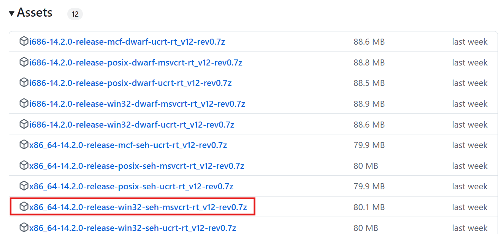

# Windows C++ Environment Setup Tutorial
For Windows users, we recommend two free and lightweight softwares as the C++ development environments: Visual Studio Code (VS Code) and Code::Blocks. Here are the key features of these two softwares:  
**Visual Studio Code (VS Code)**  
1. It contains many useful plugins and can be configued to support almost every major programming language including C/C++, Python, Java, etc.
1. The C/C++ environment in Windows may be a little difficult to be configured.  

**Code::Blocks**
1. It can only support C/C++ and Fortran.
1. The C/C++ environment is easy to set up.
  
You can choose anyone of them according to your preference. You can also use other C++ development 
tools, such as Visual Studio, Eclipse, etc.

## Visual Studio Code (VS Code)
VS Code is a code editor developed by Microsoft. It can use different extensions to support different programming languages. Here is the tutorial to set up the C++ development environment in VS Code.
### Step 1: Install VS Code
You can download the installer from the [official website](https://code.visualstudio.com/download).


When you install VS Code, you'd better select all the other options.


### Step 2: Install the C++ Extension
After you install VS Code, you can open it and click the **Extensions** button on the left side, 
then search for **C++** and install it.


### Step 3: Download MinGW-w64
VS Code is just a code editor, so you need to download a compiler to compile your code. MinGW-w64 integrates the GCC compiler into Windows. You can download MinGW-w64 from [niXman](https://github.com/niXman/mingw-builds-binaries/releases).



After you download x86_64-14.2.0-release-win32-seh-ucrt-rt_v12-rev0.7z, you just need to unzip it and place the folder to a proper
location. 

### Step 4: Add MinGW-w64 to the Enviroment Path
You should add the mingw64/bin folder to the environment path to make it be recognized by the VS Code. You can find the enviroment path in Setting/System/Avanced system settings


You can test in the VS Code terminal or windows console by typing:
```shell
g++ --version
```
If the environment path is set correctly, you will see the version of the GCC compiler:


### Step 5: Run a C++ Program
You can create a file such as main.cpp in a folder, and then open it using VS Code.
You can using the following code to test the C++ environment:

```cpp
#include <iostream>

int main() {
  std::cout << "HKUST(GZ) 2024" << std::endl;
  return 0;
}
```

To run the code, you should configure VS Code:


When you see the output "HKUST(GZ) 2024" in the terminal, you have successfully set up the C++ 
environment in VS Code.


## Code::Blocks
Code::Blocks is a integrated development enviroment (IDE) for C/C++ and Fortran. To set up the C++ 
environment in Code::Blocks, you can follow the steps below.

### Step 1: Install Code::Blocks
You can download the installer from the [official website](http://www.codeblocks.org/downloads/26).


You can select the install directory and others can be default.

### Step 2: Start a Project
After you install Code::Blocks, you can open it and start a new project.


You can use the following C++ code to test it:

```cpp
#include <iostream>

int main() {
  std::cout << "HKUST(GZ) 2024" << std::endl;
  return 0;
}
```


When you see the output "HKUST(GZ) 2024" in the console, you have successfully set up the C++
environment in Code::Blocks.