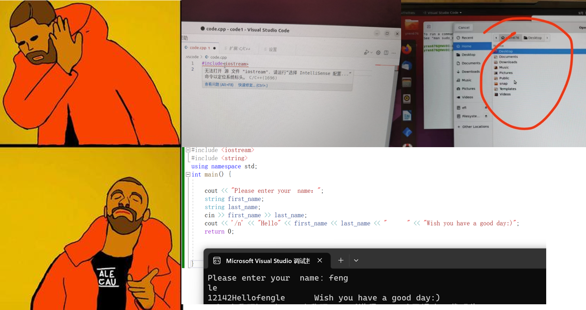

# Lab 01 - Meet The Data Types and Operators!

## Our Goal in Lab 01

1. Learn how to declare variables of different data types.
2. Learn how to print variables of different data types.
3. Understand the range of each data type.
4. Recap the operators and use them to compute.

## Some illustrative Questions in the Lecture and Lab Session

### 1. Terrible Question Raising Format



**PLEASE DONT ASK QUESTIONS BY PHOTO.**
**The discussion in Canvas is a good practical way to ask questions.**

And don’t forget to read [**how-to-ask-questions**](https://github.com/ryanhanwu/How-To-Ask-Questions-The-Smart-Way/blob/main/README-zh_CN.md) again before you ask!

## Recap the data types in C++

- Integer Numbers
- Floating-point Numbers
- Character & String

If you don’t remember their meanings, review the slides or check the [cppreference](https://en.cppreference.com/w/).
The cppreference is a very useful website that you can refer to.

## Tutorial 1: Integer Numbers and Floating-point Numbers

### Tutorial 1.1 Define and Print a Number i.e. `int`

```cpp
#include <cstdio>
#include <iostream>

int main(){
    // Define an integer number "intNumber"
    int intNumber;
    
    // Assign a value to intNumber
    intNumber = 10;
    
    // Print the integer number in std::cout
    std::cout << "The value of defined integer is: " << intNumber << std::endl;

    // Print the integer number in printf
    printf("The value of defined integer is: %d\n", intNumber);

    return 0;
}
```

### Tutorial 1.2 Print variables of different data types

```cpp
#include <cstdio>
#include <iostream>
#include <string>

int main(){
    // Declare and assign values to different data types
    int intNumber = 1;
    float floatNumber = 0.114514f;
    long int longNumber = 114514;
    char chr = 's';
    std::string str = "Hello World!";
    
    // Print the variable in std::cout
    std::cout << "The value of defined integer is: " << intNumber << std::endl;
    std::cout << "The value of defined float is: " << floatNumber << std::endl;
    std::cout << "The value of defined long is: " << longNumber << std::endl;
    std::cout << "The value of defined char is: " << chr << std::endl;
    std::cout << "The value of defined string is: " << str << std::endl;

    // Print the variable in printf
    printf("The value of defined integer is: %d\n", intNumber);
    printf("The value of defined float is: %f\n", floatNumber);
    printf("The value of defined long is: %ld\n", longNumber);
    printf("The value of defined char is: %c\n", chr);
    printf("The value of defined string is: %s\n", str.c_str());

    return 0;
}
```

### Simple Practice

* What happens when a character is printed using the `%d` placeholder?

* How to print floating-point numbers that retain three decimals? (Hint: `std::setprecision` or `%.f`)

* How to assign value `"` to `chr`?

* (Optional) What is the size of a `char` variable and why? What is the size of a string `str`?

* (Optional) How to concat two strings?

## Tutorial 2: Learn the limits of data types

We can use the utilities from the header file `<limits>` to check the numeric limits of data types.

```cpp
#incldue <iostream>
#incldue <limits>

int main(){
		
	// Create numeric_limits for type unsigned int 
	std::numeric_limits<unsigned int> limit;

	// Output the limits using std::cout
	std::cout << "unsigned int Range: " 
			<< limit.min() << "~" << limit.max() << std::endl;
	// Output the size using std::cout
	std::cout << "Size of unsigned int: " << sizeof(unsigned int) << std::endl;
	
	/* 
		Try to replace int with other data types (short, int, char, long, double, ...)
		Compare the different limits and size
	*/

	return 0;
}
```

### Thinking Time

1.  Where do the limits of each data type come from? What’s the relationship between these numeric limits and sizes?
2. What will happen if we assign some value out of the limits to the variables of these data types?

## Tutorial 3: Operators in C++

### Tutorial 3.1 Why do I have wrong results?

```cpp
#include <iostream>

int main() {
    int i = 0;

    std::cout << "result: " << (i++ < 2) << std::endl;
    std::cout << "result: " << (i++ < 2) << std::endl;
    std::cout << "result: " << (i++ < 2) << std::endl; 

    i = 0;

    std::cout << "result: " << (++i < 2) << std::endl;
    std::cout << "result: " << (++i < 2) << std::endl;
    std::cout << "result: " << (++i < 2) << std::endl; 
    
    return 0;
}

```

### Tutorial 3.2 Integer + Character = ?

```cpp
#include <iostream>

int main() {
    char character = 'a';

    std::cout << "Character: " << character << std::endl;

    int integer = 10;

    std::cout << "Integer: " << integer << std::endl;

    std::cout << "Character + Integer: " << character + integer << std::endl;

    std::cout << "static_cast<int>(Character + Integer): " << static_cast<int>(character + integer) << std::endl;

    std::cout << "static_cast<char>(Character + Integer): " << static_cast<char>(character + integer) << std::endl;

    return 0;
}

```

### Simple Practice

* How can I print the A-Z and a-z characters in the console?

## Additional Contents

### Prettier Console Output

Plain and colorless outputs make people bored, sometimes we want to emphasize some outputs with colors. Fortunately, we can make use of console colors in our outputs when coding in C++.

You can use `man console_codes`  command to learn about the methods to control console outputs. (use `q` to quit).

In the document, you can find that, to change the settings in console outputs, we need to start with the ASCII character `ESC ('\033')`. After that, we need to build up a so-called control sequence with the next character `'['`. Finally, you can refer to the section **ECMA-48 Set Graphics Rendition** to see what you can achieve using the method. You can use a string to store all these control sequences, then put it before the things you want to output. Here are some examples that you can play with:

```cpp
#include <iostream>
#include <string>

int main(){
	
	std::string default_attr = "\033[0m";       // Set attributes back to default
	std::string red_color    = "\033[31m";	    // Set the font color to red
	std::string blink_font   = "\033[5m";       // Make the text blink!
	std::string bold_font    = "\033[1m";       // Use bold font
	std::string green_bg     = "\033[42m";      // Set the background color to green

	std::cout << red_color << "Hello Red World!" << std::endl;
	std::cout << default_attr << "Hello Default World!" << std::endl;	
	std::cout << green_bg << blink_font << 
		"Hello Green Blinking World!" << std::endl;
	
	// You can try to keep outputting without going back to default attributes
	std::cout << "World, world never change!";

	// Nothing will be outputted explicitly if you only output the control sequence
	std::cout << default_attr << std::endl;
	std::cout << "Bye World!" << std::endl;

	return 0;
}
```

With all these fancy formats, you can create some interesting content in your console now! Try to create some art with these utilities, it might be your first step toward the world of Computational Media and Arts (CMA).
