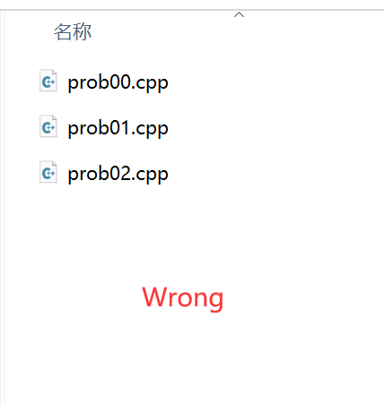
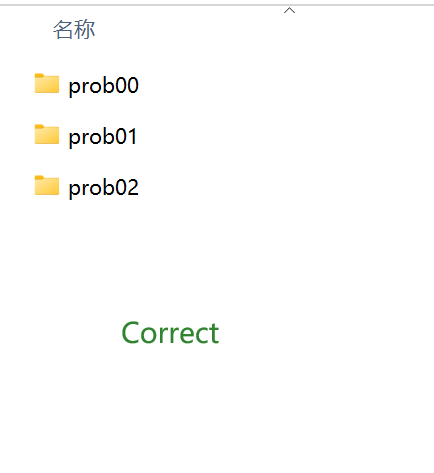

# Lab 03 C++ Vector-Loop-Function

## Important Notes
- **Please finish the problems in the contest "Lab03" in OJ by the end of this month (2024-9-30 23:59:59).**

## Some tips for VS Code
1. Create a folder for each program.

    
    

2. Open the specific folder instead of the root folder (especially for the users who want to use the button to run the code). For example, if you want to run the code in the folder "prob01", you just open the folder "prob01" using VS Code.

    
    

3. Avoid using the Chinese name for the folder or file.
    * This one and the above two tips can help you to solve many problems about the local environment.
4. For the input, you can copy and paste to save time.  
    * This tip is also applicable if you use other softwares.

    

## Our Goal in Lab 03
In this lab, you should learn how to use vector, loop and function in c++.


### C++ Vectors
Vectors in C++ are sequence containers representing arrays that can change in size. They are part of the C++ Standard Template Library (STL). Vectors use contiguous storage locations for their elements, which means that their elements can be accessed not only through iterators but also using offsets on regular pointers to elements.

Creating a Vector
```c++
#include <vector>

std::vector<int> myVector;
```

Example: Initializing a Vector and Printing its Elements
```c++
#include <iostream>
#include <vector>

int main() {
// Initializing a vector with some elements
std::vector<int> myVector = {1, 2, 3, 4, 5};

    // Using a for loop to iterate through the vector and print its elements
    for (int i = 0; i < myVector.size(); ++i) {
        std::cout << myVector[i] << " ";
    }

    return 0;
}
```

How to create a 2D matrix ? A simple way to do this is to use vector nesting [code folder provide extra example].

```c++
#include <vector>
// Declare a vector of vectors to represent the two-dimensional matrix.
std::vector<std::vector<int>> matrix;
```


### C++ Loops
#### C++ Loops: The for Loop
Loops in programming allow us to execute a block of code repeatedly until a specified condition is met. The for loop is one of the most commonly used loops in C++. It's especially handy when you know in advance how many times you want to execute a block of code.

```cpp
//Syntax of a for Loop
for (initialization; condition; update) {
// Code to execute on each iteration
}
```

Initialization: Typically used to initialize a counter variable.
Condition: The loop continues as long as this condition evaluates to true.
Update: Executes at the end of each loop iteration, usually to update the counter variable.
Example: Printing Numbers from 1 to 5

```cpp
#include <iostream>

int main() {
    for (int i = 1; i <= 5; ++i) {
        std::cout << i << " ";
    }
    return 0;
}

```

#### C++ Loops: The for (auto) Loop

In addition to the traditional for loop, C++11 introduced a range-based for loop that simplifies iterating over elements in a container. The syntax for the range-based for loop is as follows:

```c++
for (auto element : container) {
// code to be executed
}
```
Here is an example of a range-based for loop that prints elements of a vector:
```c++
#include <iostream>
#include <vector>

int main() {
std::vector<int> numbers = {1, 2, 3, 4, 5};

    for (auto num : numbers) {
        std::cout << num << " ";
    }

    return 0;
}
```
In this example, the range-based for loop iterates over each element in the numbers vector and prints it to the console.

#### C++ Loops: The while Loop
In C++, besides the for loop, you can also use the while loop for iterative execution of a block of code. The while loop continues to execute the block of code as long as the specified condition is true.

The syntax of a while loop in C++ is as follows:
```c++
while (condition) {
// code to be executed
}
```
The while loop will repeatedly execute the code block as long as the condition remains true. If the condition is false initially, the code block will not be executed at all.

Here is an example of a while loop that prints numbers from 1 to 5:

```c++
#include <iostream>

int main() {
int i = 1;

    while (i <= 5) {
        std::cout << i << " ";
        i++;
    }

    return 0;
}
```

In this example, the while loop checks if i is less than or equal to 5. If true, it prints the value of i and increments i by 1 in each iteration.


#### Break Operator

In C++, the break statement is used to exit a loop prematurely. When the break statement is encountered within a loop, the loop is immediately terminated, and the program execution continues with the code that follows the loop.

The break statement is commonly used within loops to stop the loop execution based on a certain condition. It is often used in conjunction with conditional statements to control the flow of the program.

Here is an example of using the break statement in a for loop to print numbers from 1 to 5, but exit the loop when the value of i is 3:
```c++
#include <iostream>
int main() {
    for (int i = 1; i <= 5; i++) {
        if (i == 3) {
            break; // exit the loop when i is 3
        }
        std::cout << i << " ";
    }
    return 0;
}
```

In this example, when the value of i reaches 3, the break statement is executed, causing the loop to terminate immediately.

The break statement can also be used in while and do-while loops in a similar manner to exit the loop based on a specific condition.

### C++ Functions
Functions in C++ are building blocks of reusable code that can be executed multiple times throughout a program. They allow you to encapsulate a task into a single, self-contained unit of code which makes your program more modular and easier to understand and maintain.

Basic Syntax of a Function
```c++
returnType functionName(parameter1, parameter2, ...) {
// Body of the function
}
```

**returnType**: The data type of the value the function returns. If the function doesn't return a value, this is specified as void.

**functionName**: The name of the function. Function names should be relevant to the task they perform.

**parameters**: Optional list of parameters the function takes as input. Parameters allow you to pass data into your function.

#### C++ Functions with Integer returned
Example: A Simple Function to Add Two Numbers

```c++
#include <iostream>

// Function declaration
int add(int num1, int num2) {
    return num1 + num2;
}

int main() {
    int result = add(5, 3); // Function call
    std::cout << "The sum is " << result << std::endl;
    return 0;
}

```

### Put It Together!
Now let's write a program to determine whether a number is prime.

#### Loop Based Example
```c++
#include <iostream>

int main() {
    int num;
    bool isPrime = true;
    // Ask the user to input a number
    std::cout << "Enter a positive integer: ";
    std::cin >> num;
    // Check if the number is prime
    if (num <= 1) {
        isPrime = false;
    } else {
        for (int i = 2; i <= num / 2; i++) {
            if (num % i == 0) {
                isPrime = false;
                break;
            }
        }
    }
    // Output the result
    if (isPrime) {
        std::cout << num << " is a prime number." << std::endl;
    } else {
        std::cout << num << " is not a prime number." << std::endl;
    }
    return 0;
}
```

In this program, the user is asked to input a positive integer [An advanced version is in the code folder].
The program then checks whether the input number is a prime number by iterating through all numbers from 2 to half of the input number. 
If the input number is divisible by any number other than 1 and itself, it is not a prime number, and the loop breaks early using the break statement.

## Extra Code Example
**The examples in the code folder may help you solve Lab problems**
1. checkprime.cpp: use function check prime
2. init2Dmatrix.cpp init a 2D c++ vector 