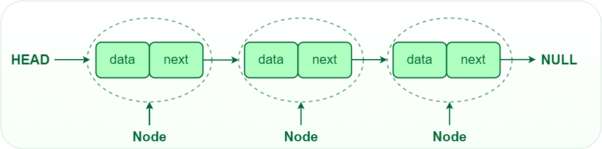
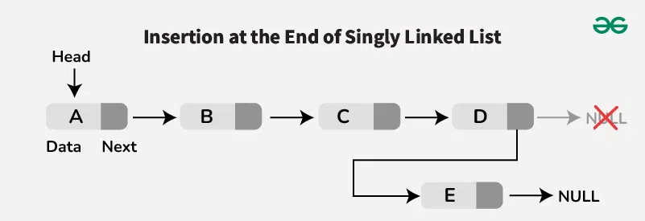
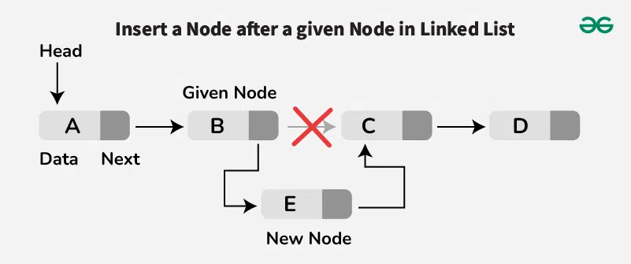

# Lab 08 Linked List

## Important Notes
- **Please finish the problems in the contest "Lab08" in OJ by the end of this week (2024-11-10 23:59:59).**

###  Run multiple .cpp files in VS Code
Find the task.json file in the .vscode folder and change the "args" to the following:
```json
      "args": [
        "-fdiagnostics-color=always",
        "-g",
        "${fileDirname}/*.cpp",
        "-o",
        "${fileDirname}\\${fileBasenameNoExtension}.exe"
      ],
```
Here we change the `${file}` to `${fileDirname}/*.cpp` to compile all the .cpp files in the same folder.

## Linked List
A linked list is a linear data structure where elements are stored in nodes. Each node contains a data element and a reference (link) to the next node in the sequence. Linked lists are dynamic data structures, meaning that they can grow or shrink in size during program execution.


### Basic Structure
Here is a basic structure for a linked list node in C++:
```cpp
struct Node {
    int data;
    Node* next;

    Node(): data(0), next(nullptr) {}
};
```
In this structure, `data` represents the value stored in the node, and `next` is a pointer to the next node in the list.
We can create a class to manage the linked list, including functions to insert, delete, and search for elements.
```cpp
class LinkedList {
private:
    Node* head;
public:
    LinkedList() : head(nullptr) {}
    ~LinkedList();
    Node* getHead() { return head; }
    void insertFront(int data);
    void insertBack(int data);
    void insertAfterKey(int key, int data);
    void deleteNode(int key);
    bool searchKey(int key);
    void print();
};
```
In this class, `head` is a pointer to the first node in the list. The member functions `insertFront`, `insertBack`, `insertAfterKey`, `deleteNode`, `searchKey`, and `print` are used to perform various operations on the linked list.

### Insert Operations
1. **Insert at the Front**: This operation inserts a new node at the beginning of the list.
```cpp
void LinkedList::insertFront(int data) {
    Node* newNode = new Node();
    newNode->data = data;
    newNode->next = head;
    head = newNode;
}
```

2. **Insert at the Back**: This operation inserts a new node at the end of the list.


```cpp
void LinkedList::insertBack(int data) {
    Node* newNode = new Node();
    newNode->data = data;
    newNode->next = nullptr;
    if (head == nullptr) {
        head = newNode;
        return;
    }
    Node* current = head;
    while (current->next != nullptr) {
        current = current->next;
    }
    current->next = newNode;
}
```

3. **Insert After a Key**: This operation inserts a new node after a specified key value.  


```cpp
void LinkedList::insertAfterKey(int key, int data) {
    Node* current = head;
    while (current != nullptr && current->data != key) {
        current = current->next;
    }
    if (current == nullptr) {
        std::cout << "Key not found" << std::endl;
        return;
    }
    Node* newNode = new Node();
    newNode->data = data;
    newNode->next = current->next;
    current->next = newNode;
}
```

### Print Operation
This operation prints the elements of the linked list.
```cpp
void LinkedList::print() {
    Node* current = head;
    while (current != nullptr) {
        std::cout << current->data << " ";
        current = current->next;
    }
    std::cout << std::endl;
}
```

### Create a Linked List
To create a linked list which is `1->2->3` , we can use the following code:
```cpp
int main() {
    LinkedList list;
    list.insertBack(1);
    list.insertBack(2);
    list.insertBack(3);
    return 0;
}
```
### Deconstructor
To avoid memory leaks, we need to delete all the nodes in the linked list when the list is destroyed.
```cpp
LinkedList::~LinkedList() {
    Node* current = head;
    while (current != nullptr) {
        Node* next = current->next;
        delete current;
        current = next;
    }
}
```


## Reference
* [VS Code Compile Multiple Files](https://blog.csdn.net/RayJinStudio/article/details/114643211)
* [Linked List](https://www.geeksforgeeks.org/introduction-to-singly-linked-list/)